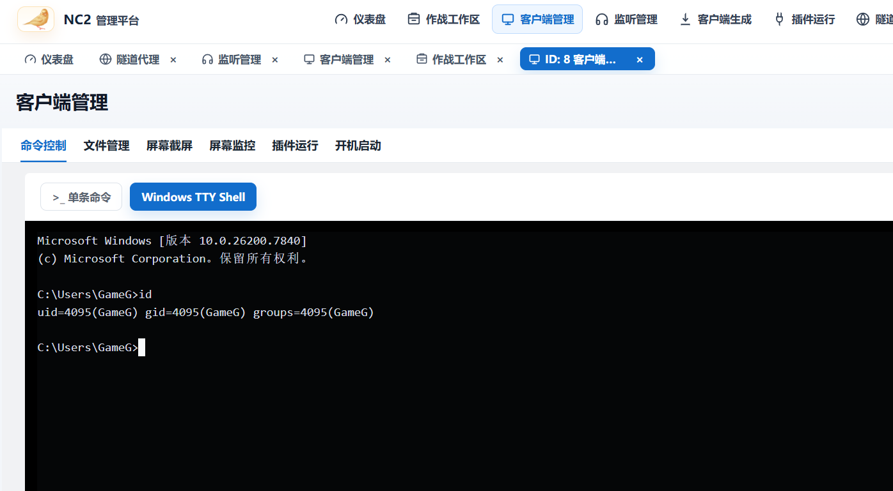

# NC2

NC2 是一个使用 Go 编写的**授权远程主机管理与安全演练平台**，功能与界面形态类似 VShell（Go 编写的轻量级主机群管理/RAT 工具），适用于CTF 内网靶场等受控场景。项目包含服务端管理台、多种形态的 Agent、WebSocket 实时数据面、隧道与端口转发、文件/终端/截图管理，以及一套独立的命令行管理工具。

> ⚠️ 仅限在获得授权的环境中使用。部署前请修改默认密码、注册令牌和会话密钥。

## 功能特性

- **Web 管理台**：原生 HTML/CSS/JS，无需 Node 构建，内置仪表盘、客户端管理、监听器、客户端生成、隧道代理、端口转发、作战工作区与拓扑图。
- **多形态 Agent**：
  - 主线 Agent：Windows/Linux，覆盖 amd64/386/arm64/armv7；
  - Windows 兼容 Agent：Go 1.20 构建，支持 Win7 SP1 / Server 2008 等旧系统；
  - C 版 Windows Agent：约 245KB 小体积、无运行时依赖。
- **实时终端**：Windows ConPTY、Linux PTY、旧系统管道 CMD，二进制帧原样传输 ANSI/VT 数据。
- **文件管理**：目录浏览、上传/下载（v3 通道，单文件最大 128 MiB）、SHA-256 校验与原子写入。
- **屏幕截图**：Windows 多显示器截图、多档压缩、分块读取与预览。
- **隧道代理**：SOCKS5 / HTTP CONNECT / TCP 固定转发，按 Stream 隔离的流量窗口与背压控制。
- **Agent 端口转发**：在线 Agent 绑定内网端口，经服务端中转到目标 Agent 或“当前 server”。
- **Bind 正向连接**：目标主机主动监听，服务端通过代理链回连，复用任务/终端/文件/隧道能力。
- **客户端监听器与多级 Pivot**：基于已上线 Agent 的 HTTP 反向代理链，支持多级嵌套。
- **作战工作区**：工作区、内网资产台账、Agent 标签/备注/归属管理。
- **命令行工具 nc2ctl**：Python 标准库单文件 CLI，覆盖监听器、任务、隧道、正向连接、工作区等管理操作。
- **审计与日志**：可选审计落 SQLite + JSON Lines，支持查询。

## 优势

- **纯 Go + 纯 Go SQLite**：`CGO_ENABLED=0` 交叉编译，无 GCC/运行时依赖，单二进制发布。
- **低延迟控制面**：Agent 与监听器使用持久 WebSocket 长连接，服务端主动推送任务，无需轮询。
- **资源与安全边界完整**：任务结果、传输分块、隧道流数/窗口/并发均有上限；路径穿越、删除保护、上传校验与结果幂等内置。
- **老系统兼容**：兼容 Agent 固定 Go 1.20.14，规避新版 Go 对旧 Windows 的运行时依赖。
- **小体积选项**：C 版 Agent 约 245KB，适合对体积敏感的上线场景。
- **一套协议、多种形态**：Reverse / Bind / 客户端监听器复用同一任务与数据面协议，扩展新任务有固定流程。
- **开箱即用**：Web 静态资源随仓库提交，浏览器不需要 npm；`nc2ctl` 不需要第三方 Python 包。

## 快速开始

```powershell
# 启动服务端（默认读取 config.conf）
go run ./cmd/server -config .\config.conf

# 默认管理地址：http://127.0.0.1:28081/
# 默认账号：admin / admin123（部署前必须修改）

# 启用默认监听器后，手工上线一个 Agent
go run ./cmd/agent -server http://127.0.0.1:63337 -token change-me -listener default
```

命令行管理：

```powershell
python .\nc2ctl\nc2ctl.py config init
$env:NC2_PASSWORD = "replace-me"
python .\nc2ctl\nc2ctl.py --output json agent list --status online
```

## 构建发布

```powershell
.\scripts\build_linux.ps1    # Linux amd64 服务端 + 18 个 Agent/Bind 模板
.\scripts\build_win.ps1      # Windows amd64 服务端 + 20 个模板（含 C 版）
.\scripts\build_agent_c.ps1  # 单独构建 C 版 Windows Agent（需要 VS2022）
```

## 安全说明

- 默认配置仅用于本地开发，部署前必须修改 `web.password`、`agent.register_token`、`security.jwt_secret` 与所有 Bind key。
- `tls.enable` 只保护管理服务端；监听器、客户端监听器和 Bind 当前不是端到端 TLS，不应直接暴露到不可信网络。
- 隧道密码与 Bind key 按需求明文存储/返回，请把管理端、数据库与备份视为同等敏感边界。


## 管理界面





## 相关文档

- [开发对接说明](dev_readme.md)：代码地图、协议、构建发布、任务扩展与常见问题
